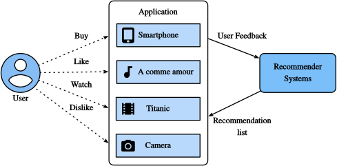

# Overview of Recommender Systems

Recommender systems

- information **filtering** tools

- Collaborative Filtering

> people collaborate to help one another perform the filtering process in order to handle the large amounts of email and messages posted to newsgroups

- Explicit Feedback and Implicit Feedback
